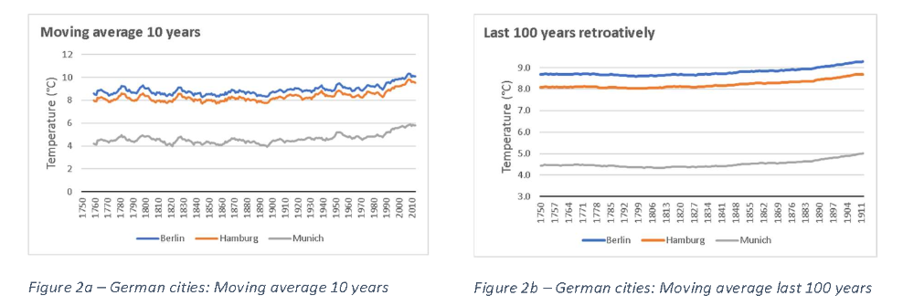

## Exploring-Weather-Trends
First project for my Data Analyst Nanodegree by Udacity.  
 
The main objective here is to analyze local and global temperature data and compare the temperature trends in the city I live to overall global temperature trends.  
As a secondary goal, trends in temperature between Global, Berlin and the other Germany cities of Munich and Hamburg are parsed.  
### Tools and sources
I use the SQL Workspace from Udacity to extract data from the temperatures database, then download the results to csv files. The data is analyzed using Excel spreadsheet.  
 
Three files have been provided by Udacity:  
•	city_list - This contains a list of cities and countries in the database. Look through them in order to find the city nearest to me.  
•	city_data - This contains the average temperatures for each city by year (ºC).  
•	global_data - This contains the average global temperatures by year (ºC).    
 
Calculations and graphs are made with Excel and results are presented in PDF.  

 
*Graphs for moving average considering Berlin and Global trends* 
 
*Graphs for moving average considering German cities* 

### License
MIT License
Copyright (c) 2010-2019 Google, Inc. 
